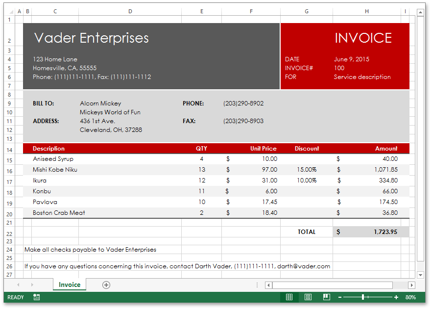

<!-- default badges list -->

<!-- default badges end -->

# Excel Export API  - Generate an Invoice

This example demonstrates how to use the [Excel Export API](https://documentation.devexpress.com/OfficeFileAPI/114031/Excel-Export-Library) to generate the "Simple Invoice" document shown in the image below.

## Implementation Details

In particular, this example introduces API properties and methods used to perform the following operations:

* Create a new workbook
* Create and rename a worksheet
* Create columns and rows, and adjust the column width and row height
* Create cells and set their values
* Format cells (set the cell font, background color, alignment, borders, number format, etc.)
* Specify print options (define the print area and adjust page settings)
* Assign formulas to worksheet cells

## Files to Review

* [Form1.cs](./CS/XLExportExample/Form1.cs) (VB: [Form1.vb](./VB/XLExportExample/Form1.vb))
* [InvoiceData.cs](./CS/XLExportExample/InvoiceData.cs) (VB: [InvoiceData.vb](./VB/XLExportExample/InvoiceData.vb))
<!-- feedback -->
## Does this example address your development requirements/objectives?

 

(you will be redirected to DevExpress.com to submit your response)
<!-- feedback end -->
